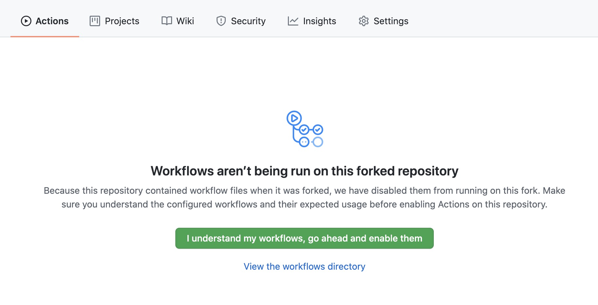
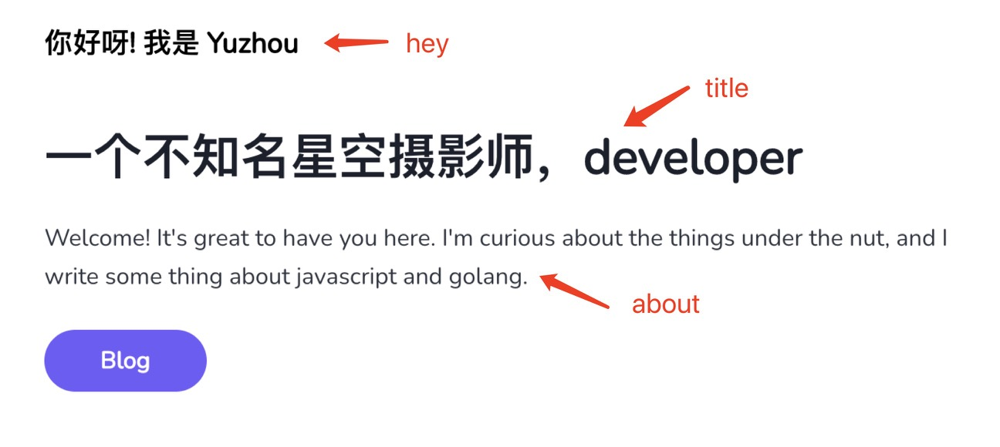

小而美的 blog 框架，用户只用在初期进行基础配置，以后只需要写 markdown 文件，推送到 github，blog 会自动部署到 GitHub page。

## 项目愿景

使会基础 git 操作和 markdown 语法的人，无需编程知识，也可以轻松搭建精美的 blog。

## 前置要求

1. 首先 fork https://github.com/yuzhouu/swallow 该仓库，然后去 仓库设置>pages>source 中将 Branch 切换为 gh-pages 点击 save.
2. 点击 actions Tab, 打开 GitHub workflow，项目需要 workflows 去自动化部署到 github page 
3. 可选步骤: 在设置中修改你的 repo 名称，建议为`你的用户名.github.io`，这样你可以通过`https://你的用户名.github.io`访问到你的 blog

## 了解目录结构

```
｜- .github // github action 部署脚本
｜- data
｜- ｜ - blog // 博客内容
｜- ｜- images // 博客中使用到的图片资源
｜- google-tracking-id // 你的google UA id
｜- meta.json // 网站元数据
｜- site // 用于blog生成的框架源码，非深度定制化不需要改动这里
```

## 修改 data/meta.json

这是项目的基础配置，请根据注释，修改`data/meta.json`中的配置项

```json5
{
  site: {
    // 网站名称
    title: "Ordinary Days",

    // 网站的url
    siteUrl: "https://yuzhou.github.io/swallow",

    // 用于rss 和 网站seo的描述
    description: "Blog模版，github action自动生成blog，无需了解前端知识",

    // github 用户名/仓库名
    githubRepo: "yuzhouu/swallow",

    // 网站底部链接 name用于匹配图标
    footerLinks: [
      {
        name: "github",
        link: "https://github.com/yuzhouu/swallow",
      },
      {
        name: "rss",
        link: "/rss.xml",
      },
    ],

    // 启用issue comment，需要为repo 注册utterances，参考 /data/blog/doc-advanced.md
    enableComment: true,
  },

  // 作者相关信息
  author: {
    // 作者名称
    name: "YuZhou",
    // 作者主页链接
    link: "https://github.com/yuzhouu",
  },

  // GitHub pages 前缀
  // - 例如你的仓库名称为xx，则pathPrefix 必须为 xx;
  // - 其他特殊情况：若你的仓库名为xx.github.io, pathPrefix 为 /
  pathPrefix: "swallow",

  // 页面文案配置
  docs: {
    // 首页头部文案
    hey: "你好呀! 我是 Yuzhou",
    title: "一个不知名星空摄影师，developer",
    about: "Welcome! It's great to have you here. I'm curious about the things under the nut, and I write some thing about javascript and golang.",

    // 博客页头部文案
    blogSlogan: "细雨鱼儿出，微风燕子斜",
  },
}
```

### 页面文案位置详解




## 写你的第一篇 blog

文章会自动通过`data/blog`下的 markdown 生成，文件路径 _（不能为中文）_ 自动映射到网站 url， 例如`hello.md` 会自动映射到 `yourdomain.com/blog/hello`。

同时注意每一篇 blog 都需要 frontmatter 信息
例子

```
---
title: 使用说明
tags: [doc]
date: 2021-11-16
---

你的markdown正文
```

## avatar 头像设置


### 基础设置

当你正确设置了 meta.json 中的 githubRepo 字段，框架会自动拉取你的 github 头像做完 blog 头像

### 进阶设置

在`/data/images`文件夹下放一张 avatar.png 图片，该图会自动覆盖 github 头像成为你的 blog 头像

## 部署

使用的 git 工具推送到 github，github 会自动部署，部署进度可以到项目的 action tab 下查看。

- 部署成功后网页在 `https://你的用户名.github.io/项目名称`。
- 如果你的仓库名称为`你的用户名.github.io`, 部署成功后网页在 `https://你的用户名.github.io/`

## 限制

由于框架基于 gatsby，因此存在以下限制

- `data/blog` 目录下必须存在一篇 frontmatter 信息完整的文章，即 title，tags, date 均不为空。（gatsby 会根据这些信息生产 graphql schema，字段为空会导致生成的 schame 不完整，从而报错）
- `data/blog` 目录下的文件名称需要为英文,-,\_,数字组成的字符串，不能为中文。（gatsby 使用 sindresorhus/slugify 生成 url，中文经过 slugify 后为空字符串，导致路由报错）
